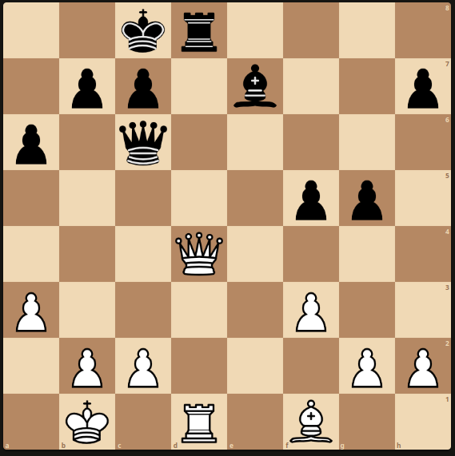
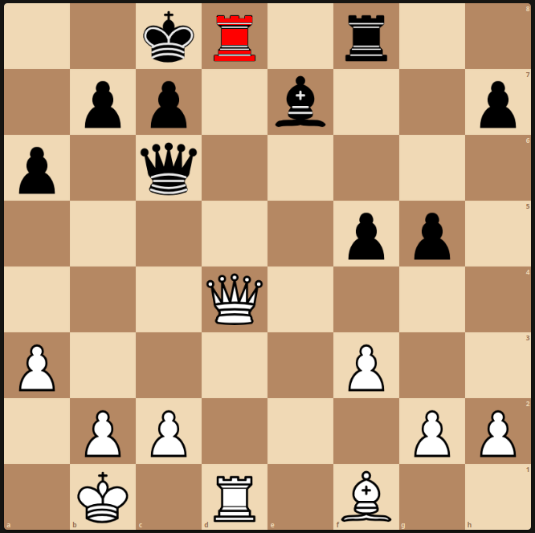
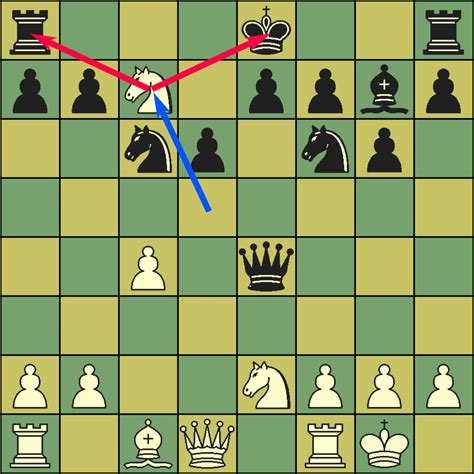

# Laboratorio: Bot de Ajedrez con Patrones Tácticos y Representación del Conocimiento   

## Objetivos de Aprendizaje

- Profundizar en conceptos avanzados de Prolog
- Implementar patrones tácticos en un bot de ajedrez empleando Prolog

## Descripción General

En esta práctica mejorarás el bot de ajedrez desarrollado en prácticas anteriores, incorporando patrones tácticos reconocidos mediante Prolog. Intuitivamente, los patrones tácticos son jugadas inteligentes que aprovechan una debilidad en la posición del rival. La idea es que el bot pueda reconocer estas configuraciones en el tablero y darles prioridad a la hora de explorar jugadas.

Dicho de otra forma: **usaremos patrones tácticos detectados con Prolog para reordenar los movimientos en la búsqueda alpha-beta, de modo que las jugadas que impliquen patrones tácticos se exploren primero.**

**Disclaimer**: Usaremos definiciones simplificadas de los patrones tácticos por motivos pedagógicos. Por lo tanto, la definición de los patrones tácticos puede diferir de las de los manuales de ajedrez. ¡Usa las definiciones de la práctica!

### Mejoras sobre la Práctica Anterior
Esta práctica asume que se parte de un `HeuristicAlphaBetaBot` básico sobre el que no se hayan implementado modificaciones en el orden en que se explorar los movimientos. **Si has implementado _killer moves_ o heuristicas similares, desactívalas antes de empezar la práctica**

### Instalación de Dependencias

Esta práctica requiere la librería `pyswip`, que proporciona la conectividad entre Python y Prolog. Instálala usando pip:

```bash
pip install pyswip
```

## Guías de Entrega

### Entrega en GitHub Classroom
1. Acepta la tarea a través del enlace de GitHub Classroom
2. Clona tu repositorio asignado
3. Implementa todos los componentes requeridos
4. Incluye pruebas y documentación completas
5. Sube tu entrega final antes de la fecha límite

### Cumplimiento de API
Tu implementación será probada con scripts automatizados. La API debe seguirse exactamente - cualquier desviación resultará en fallos en las pruebas.

Se recomienda ejecutar tus propias pruebas para asegurar el cumplimiento de la API.

### Código de Honor

Está permitido discutir tareas en grupo, siempre que cada estudiante escriba sus propias soluciones desde cero y no reuse código de otros compañeros. Es una violación al código de honor compartir o consultar soluciones de otros estudiantes o de años anteriores, subir el trabajo a repositorios públicos o usar IA generativa para obtener respuestas directas o copiar soluciones.

El uso de herramientas de IA generativa, como Co-Pilot o ChatGPT, está permitido como apoyo, pero no se deben copiar soluciones completas. Usar IA para completar sustancialmente una tarea constituye una violación al código de honor.

**Las entregas sospechosas de violaciones del código de honor podrán ser sometidas a una defensa práctica. La fecha y hora de la defensa será decidida por el profesor y no será negociable.**

**Las violaciones graves del código de honor resultarán en la pérdida de una o varias convocatorias así como la apertura de expediente académico.**

# Descripción del Código Base
## Interfaz Prolog-Python
La totalidad del código base realizando la comunicación entre Prolog y Python ya está implementado. El archivo tactical_alphabeta_bot.py contiene:

**`PrologChessInterface`**: Interfaz que comunica Python con Prolog (pyswip), convirtiendo el tablero de ajedrez a hechos Prolog y consultando patrones tácticos.

**`TacticalAlphaBetaBot`**: Bot de ajedrez que implementa búsqueda minimax con poda alpha-beta y usa Prolog para detección de patrones tácticos. Este es el Bot que mejoraremos en 
esta práctica. El método más interesante es `order_moves`, que reordena los movimientos usando los patrones tácticos detectados en Prolog. Para hacer esto, simplemente asocia 
a cada movimiento una puntuación táctica sumando las puntuaciones de los patrones tácticos detectados por Prolog, y luego ordena los movimientos según esta puntuación (que llamaremos, en lo que sigue, "puntuación python"). 

La "puntuación python" se basa en una puntuación base para cada patrón táctico, y una puntuación devuelta por Prolog para cada patrón táctico detectado. Por ejemplo: el score asociado a un fork (ataque doble) es `100 + prolog_fork_score * 3`. El valor `100` es la puntuación base del fork, y `prolog_fork_score` es la puntuación devuelta por Prolog para el fork detectado. Esto es útil ya que, por ejemplo, un fork que ataque dos torres (piezas valiosas) debería tener una puntuación mayor que un fork que ataque dos peones (piezas menos valiosas). La puntuación devuelta por Prolog permite diferenciar estos casos.


## KB de Prolog

El fichero `chess_patterns.pl` contiene funciones auxiliares que te serán útiles (¡estudialas!) y las definiciones de los patrones tácticos que debes completar. 

Esta KB recibe desde python las posiciones actuales de las piezas y los movimientos válidos. A continuación, usa estas posiciones y potenciales movimientos para detectar patrones tácticos. Como ejemplo, consideremos el patrón táctico *skewer*. Un *skewer* ocurre cuando una pieza ataca a una pieza valiosa, de modo que la pieza valiosa está obligada a moverse. Cuando la pieza valiosa se mueve para evitar la captura, expone otra pieza detrás de ella. Consideremos la siguiente posición, donde mueven las negras:


Si la torre se ubica en d8, obliga a la reina blanca a moverse. Hagan lo que hagan las blancas, las negras ganarán material.





¿Cómo "razona" Prolog sobre esta posición? Para que la implementación sea eficiente (y sobre todo, sencilla), cuando Prolog examina un movimiento que mueve la pieza en `(FromR, FromC)` hasta `(ToR, ToC)`, Prolog mantiene la pieza en su posición original y se la "imagina" en su posición destino. Para el movimiento anterior, Prolog mantiene la posición original y se "imagina" la posición final (en rojo):



Esto permite que Prolog no tenga que hacer y deshacer movimientos cuando evalúa opciones. La única desventaja es que, cuando consideramos si una pieza puede atacar a otra, debemos recordar que la posición original de la pieza debe ser ignorada. Esta función auxiliar ya está implementada en `path_clear_ignoring`.
`path_clear_ignoring(R1, C1, R2, C2, IgnoreR, IgnoreC)` verifica si el camino entre dos casillas `(R1, C1)` y `(R2, C2)` está despejado (sin piezas intermedias), pero ignorando una casilla específica `(IgnoreR, IgnoreC)`.


Una posible implementación para detectar skewers (básica e incompleta) se muestra a continuación. (El siguiente código tiene omisiones intencionales que completarás en una tarea posterior.)

 La siguiente implementación evalúa si el movimiento que mueve la pieza desde `(FromR, FromC)` hasta `(ToR, ToC)` crea un *skewer*. De existir un *skewer*, la variable `SkewerScore` se substituirá por un valor indicando la potencia del *skewer*. Aunque la actual fórmula es mejorable,  está asociaría una mayor puntuación si creamos el skewer con un alfil que si lo creamos con una reina (ver `AttackerValue`). De forma análoga, preferirá obligar a que se mueva un rey a que se mueva una reina (ver `FrontValue`).

Estudia el código, ya que profundiza en algunos detalles de la sintaxis Prolog que necesitarás para la práctica (específicamente, sintaxis OR y aritmética IS) y es una plantilla útil para los siguientes ejercicios.

```prolog
move_creates_skewer(FromR, FromC, ToR, ToC, SkewerScore) :-
    % 1. BINDING: Obtener el tipo de pieza atacante
    piece(AttackerType, Color, FromR, FromC),
    
    % 2. La pieza debe poder atacar en línea (reina, alfil o torre)
    can_attack_along_line(AttackerType, _),
    
    % 3. BINDING: Buscar dos piezas enemigas en línea
    piece(FrontType, TargetColor, R2, C2),
    piece(BehindType, TargetColor, R3, C3),
    
    % 4. Verificar que no sean la misma pieza
    (R2, C2) \= (R3, C3),

    % 5. Verificar que la pieza es valiosa. Fíjate en la sintaxis para añadir un OR en prolog: ; significa OR
    (FrontType = k; FrontType = q),
    
    % 6. Verificar alineación: destino -> pieza frontal -> pieza detrás
    on_same_line(ToR, ToC, R2, C2, R3, C3),

    % 7. PATH_CLEAR_IGNORING: Caminos despejados (ignorando la casilla origen)
    %    Esto es necesario porque la pieza aún está en FromR,FromC pero
    %    queremos simular que ya se movió a ToR,ToC
    path_clear_ignoring(ToR, ToC, R2, C2, FromR, FromC),
    
    % 8. ARITMÉTICA IS: Calcular la puntuación del skewer
    %    BINDING: piece_value busca y liga los valores
    piece_value(FrontType, FrontValue),
    piece_value(AttackerType, AttackerValue),
    %    IS: Evalúa la expresión aritmética
    SkewerScore is FrontValue - AttackerValue.
```

# Tareas

Las Tareas siguen un orden que facilita la narrativa, pero este no es el orden en el que se deben completar. Se sugiere:
1. Leer el enunciado en su totalidad para comprender la estructura de la práctica.
2. Realizar las tareas en orden creciente de complejidad. La complejidad de las tareas se indica en el título de cada tarea


## Tarea 1: Modificación de heuristic_alphabeta_search (Complejidad: baja)
Dado que queremos que alpha-beta sea capaz de reordenar los movimientos, será necesario modificar la definición de la implementación actual de `heuristic_alphabeta_search`

* **Objetivo**: Modificar la función `heuristic_alphabeta_search` para que acepte un parámetro adicional: una función de ordenamiento de movimientos: 
`order_moves_callback: Callable[ [chess.Board, list[chess.Move]], list[chess.Move]`. La interfaz final de `heuristic_alphabeta_search` será:
```python
def heuristic_alphabeta_search(
    game: GameProblem,
    state: GameState,
    eval_fn: Callable[[GameState, Any], float],
    cutoff_test: Callable[[GameState, int, float], bool],
    order_moves_callback: Callable[
        [chess.Board, list[chess.Move]], list[chess.Move]
    ] | None = None,
) -> Any:
```
Por defecto, `order_moves_callback` tendrá un valor `None`. Cuando esto ocurra, no se realizará ningún reordenamiento de movimientos (y `heuristic_alphabeta_search` funcionará como en la práctica anterior).

Esta función debe recibir una lista de movimientos y retornar la misma lista ordenada según algún criterio (por ejemplo, priorizar capturas). El ordenamiento de movimientos mejora la eficiencia de la poda alpha-beta al explorar primero los movimientos más prometedores.


## Reordenamiento con Capturas, Jaques y Promociones
Empecemos a implementar predicados Prolog que nos permitan detectar patrones interesantes. Empecemos por detectar capturas y promociones. Aunque estos no se consideran patrones tácticos, es muy habitual usarlos para puntuar movimientos. Habitualmente también se consideran los jaques, pero estos ya están implementados en python y no te tienes que preocupar de ellos. 

La estrategia para todos los siguientes apartados de Prolog debería ser la misma. Traduce las reglas lógicas a Prolog usando los predicados auxiliares. Las *reglas lógicas* contienen todas las restricciones necesarias para implementar la regla, por lo que no necesitas saber ajedrez para hacerlo.


## Tarea 2: Capturas con heurística MVV-LVA (Most Valuable Victim - Least Valuable Attacker) (Complejidad: media)
**Objetivo** : Implementar el predicado `move_creates_capture/5` en Prolog.
`move_creates_capture(FromR, FromC, ToR, ToC, MvvLvaScore)`

**Descripción**: Detecta si un movimiento es una captura y calcula su puntuación MVV-LVA (Most Valuable Victim - Least Valuable Attacker). Esta heurística prioriza capturas que maximizan el valor de la pieza capturada mientras minimizan el valor de la pieza atacante. Usaremos como score:
`VictimValue * 10 - AttackerValue`, 
 donde multiplicar por 10 asegura que capturas de piezas valiosas siempre tengan prioridad sobre el valor del atacante.

Por ejemplo: 
* Capturar una reina (valor=9) con un peón (valor=1): 
`Score = 9*10 - 1 = 89`
* Capturar un peón (valor=1) con una reina (valor=9):
`Score = 1*10 - 9 = 1`

**Reglas lógicas**: El predicado debe obtener la pieza atacante en la posición origen y verificar si existe una pieza víctima en la casilla destino. (Usa `piece` para ambas queries.) Ambas piezas deben ser de colores opuestos. Los valores numéricos de cada tipo de pieza se obtienen usando `mvv_lva_piece_value` (No uses `piece_value`, ya que debemos considerar un valor alternativo para el rey al valor habitual). La puntuación se calcula mediante la fórmula: `(VictimValue * 10) - AttackerValue`.

## Tarea 3: Promociones (Complejidad: baja)
**Objetivo**: Implementar el predicado `move_creates_promotion/4` en Prolog:
`move_creates_promotion(FromR, FromC, ToR, ToC)`

**Descripción**: Detecta si un movimiento es una promoción de peón (cuando un peón alcanza la última fila del tablero).

**Reglas lógicas**: El predicado debe verificar dos casos: (1) Para peones blancos: la pieza en origen debe ser un peón blanco y el destino debe ser la fila 8 (`Fila =:= 8`). (2) Para peones negros: la pieza en origen debe ser un peón negro y el destino debe ser la fila 1 (`Fila =:= 1`). 

## Patrones Tácticos
## Tarea 4: Completar la implementación del skewer (Complejidad: baja)


**Objetivo**: Mejorar el predicado `move_creates_skewer/5` en Prolog.

**Descripción y reglas lógicas**: Hay varias omisiones en el código base de *skewer*. Completa el código anterior siguiendo las siguientes instrucciones:
* Falta verificar que los colores del atacante y los colores de la pieza `Front` y `Back` sean opuestos. Busca y usa la función auxiliar adecuada. 
* La verificación de pieza valiosa está incompleta. Debe incluirse también a la torre.
* Falta verificar que el camino entre la pieza `Front` y la `Behind` esté despejado. 
* La fórmula del score está incompleta. Debe ser: `FrontValue + BehindValue - AttackerValue`.

## Tarea 5: Fork (Complejidad: media)


**Objetivo**: Implementar `move_creates_fork(FromR, FromC, ToR, ToC, ForkScore)`.

**Descripción**: Un fork ocurre cuando una pieza ataca simultáneamente dos o más piezas valiosas del oponente. Ver la siguiente figura para una ilustración visual del concepto de fork. En la figura, el caballo ataca simultáneamente a la torre y al rey. El rey deberá moverse y las blancas ganarán una torre.



**Reglas lógicas:** Obtener la pieza atacante en origen. Buscar dos piezas distintas del color opuesto que sean valiosas. Para nuestro fork,
Ambos objetivos del fork deben ser piezas valiosas, y definimos pieza valiosa como un rey, una reina o una torre. Verificar que la pieza en el destino puede atacar ambos objetivos usando `can_attack_ignoring/7`, que simula el ataque ignorando la casilla origen (ver discusión en el ejemplo del *skewer*). Las dos piezas objetivo deben ser diferentes entre sí y no estar en la casilla origen. La puntuación se calcula como `Target1Value + Target2Value - AttackerValue`.

## Tarea 6: Pin Absoluto (complejidad: alta)

**Objetivo**: Implementar `move_creates_absolute_pin(FromR, FromC, ToR, ToC, PinScore)`.

**Descripción** : Un pin absoluto ocurre cuando una pieza no puede moverse sin exponer el rey propio a un ataque directo (lo cual está prohibido por las reglas del ajedrez). Ver la siguiente figura para una ilustración visual del concepto de pin absoluto. En esta figura, la torre negra no se puede mover, ya que el alfil podría capturar al rey (lo cual es ilegal). Como consecuencia, las negras perderán la torre.


**Reglas lógicas**: Obtener la pieza atacante que debe poder atacar en línea. Buscar una pieza enemiga (la pieza "clavada" o "pinned") y el rey enemigo, que estarán alineados con el destino del atacante mediante `on_same_line/6`. Verificar que ninguna de estas piezas esté en la casilla origen. Los caminos entre destino-pinned y pinned-rey deben estar despejados usando `path_clear_ignoring/6`. La puntuación se calcula como `(PinnedValue + KingValue - PinnerValue) // 2`. Usa `//` para emplear la división entera.

## Tarea 7: Pin relativo (Complejidad: alta)
**Objetivo:** Implementar `move_creates_relative_pin(FromR, FromC, ToR, ToC, PinScore)`

**Descripción**: Un pin relativo ocurre cuando una pieza no puede moverse sin exponer una pieza más valiosa (que no sea el rey) a un ataque. En la siguiente figura, el caballo está "clavado" o "pinned" porque, si se moviera, el alfil blanco capturaría la reina.


**Reglas lógicas**: Similar al pin absoluto, pero la pieza objetivo NO debe ser el rey. Como asunción simplificadora, debe verificarse que el valor de la pieza objetivo sea mayor que el de la pieza clavada (`TargetValue > PinnedValue`). El valor de la pieza objetivo también debe ser mayor que el de la pieza atacante. El resto de verificaciones (alineación, caminos despejados, colores opuestos) son idénticas. La puntuación se calcula como  `(PinnedValue + TargetValue - PinnerValue) // 2`.


## Tarea 8: Evaluación de la ordenación de movimientos (Complejidad: baja)
Todo este trabajo debería resultar en más podas con respecto a la versión de la práctica anterior. ¿Cómo verificarlo? Nótese que es muy importante testear cualquier hipotética "mejora" del código con pruebas objetivas. Sin estas pruebas, las "mejoras" pueden acabar siendo Bugs terribles...

Para comparar `TacticalAlphaBetaBot` con `HeuristicAlphaBetaBot` modificaremos `heuristic_alphabeta_search` para que lleve la cuenta del número de nodos visitados, podas realizadas, etc.

Concretamente, se pide que el nuevo prototipo sea:

```python
def heuristic_alphabeta_search(
    game: GameProblem,
    state: GameState,
    eval_fn: Callable[[GameState, Any], float],
    cutoff_test: Callable[[GameState, int, float], bool],
    order_moves_callback: Callable[
        [chess.Board, list[chess.Move]], list[chess.Move]
    ] | None = None,
) -> tuple[Any, SearchStatistics]:
```

donde 

```python
class SearchStatistics(NamedTuple):
    """
    Statistics collected during alpha-beta search.

    :param nodes_visited: Total number of nodes evaluated
    :type nodes_visited: int
    :param pruning_count: Number of times alpha-beta pruning occurred
    :type pruning_count: int
    :param max_depth_reached: Maximum depth reached in search
    :type max_depth_reached: int
    """

    nodes_visited: int
    pruning_count: int
    max_depth_reached: int
```

Fíjate que la implementación de `TacticalAlphaBetaBot` ya asume que `heuristic_alphabeta_search` devuelve estadísticas, las recolecta e imprime al final de la partida. **Esto significa que no podrás ejecutar `TacticalAlphaBetaBot` hasta completar esta tarea.**


Crea un `PERFORMANCE.md` que compare el porcentaje de pruning de `HeuristicAlphaBetaBot` (el de la anterior práctica) con el porcentaje de pruning de `TacticalAlphaBetaBot`. Explica las pruebas hechas, métricas obtenidas y conclusiones. 

Ten en cuenta que...

* El reordenamiento de movimientos puede ser poco efectivo en los principios de partida. Por lo que se sugiere que se usen partidas en el *middlegame* para las pruebas (ver opción de `--position` en el `main.py`).
* La prueba más sencilla es comparar ambos bots contra un mismo oponente más débil. De usarse `RandomBot`, sería deseable fijar la semilla del Bot para que las jugadas al azar sean las mismas en todas las partidas y la comparación entre `HeuristicAlphaBetaBot` y `TacticalAlphaBetaBot` sea justa.
